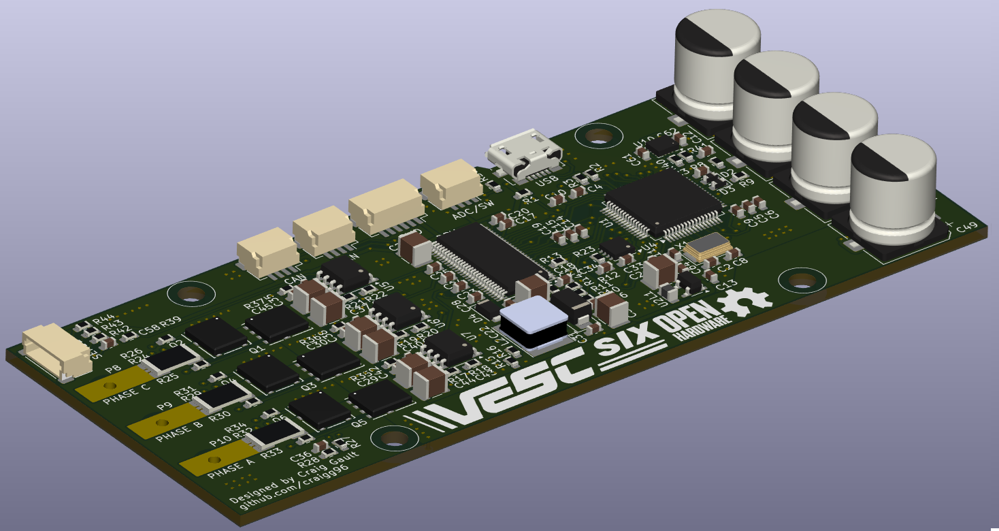

# 00. 전체 지도 + 용어사전 (여기부터)

> 제어이론도 보드도 처음인 분을 위한 길잡이입니다.
> 어려운 수식은 **다 건너뛰고**, "무엇이 무엇을 위해 있는지" 큰 그림만 잡아요.

---

## 0. 우리가 결국 하려는 일 (딱 한 문장)

<b style="color:#2e9e6b;">🎯 전기(배터리)를 잘게 쪼개서, 모터가 원하는 속도·힘으로 돌게 만든다.</b>

이 한 문장을 위해 모든 부품과 코드가 존재합니다. 끝까지 이것만 기억해도 됩니다.

↑ 이 한 장의 보드가 바로 "전기를 쪼개 모터를 돌리는" 장치입니다. 초록 기판 위 큰 원통(커패시터)·검은 칩(MCU)·작은 사각(MOSFET)이 보이죠.

> ⭐ **이거 실무에서 진짜 중요해요?** — 네. 이 문장은 **모터제어·전력전자 분야 전체를
> 한 줄로 줄인 것**입니다. 회사에서 인버터·모터 드라이브를 만든다는 건 사실상
> 평생 이 한 문장을 더 잘·더 효율적으로·더 정밀하게 하는 일이에요.

### 이 한 문장을 두 조각으로 뜯어보기

<b style="color:#2f5f8f;">① "전기를 잘게 쪼개서" = 인버터 / PWM</b> 
배터리는 그냥 일정한 DC(예: 48V)일 뿐입니다. 이걸 <b>전력 스위치(MOSFET)로 1초에
수만 번 켰다 껐다</b> 해서, 모터가 필요로 하는 <b>3상 교류 전압</b>을 합성합니다.
이게 <b>인버터</b>가 하는 일이고, 깜빡임의 비율을 정하는 게 <b>PWM</b>(자료 02)입니다.
 → 모든 전기차·태양광·에어컨·전철에 똑같이 들어가는 핵심 기술.

<b style="color:#2e9e6b;">② "원하는 속도·힘으로" = 제어 / FOC</b> 
그냥 돌리는 게 아니라 <b>"지금 300rpm, 토크 0.5N·m"</b>처럼 정확히 맞춥니다.
이때 <b>힘(토크) = 전류</b>, <b>회전 = 전압의 주파수</b>로 조절합니다. 전류를 똑똑하게
나눠 제어하는 방법이 <b>FOC(벡터제어)</b>(자료 04)예요.
 → 로봇이 정확히 멈추고, 드론이 안정적으로 뜨는 이유.

### 실무에서 어디에 쓰이나 (전부 같은 원리)

전기차 구동모터
로봇 관절(★우리 프로젝트)
드론 ESC
인버터 에어컨·세탁기
산업용 서보·CNC
엘리베이터·전동공구

겉모습은 달라도 **속을 열면 전부 "DC → 스위칭 → 3상 → 제어"** 로 똑같습니다.
한 번 제대로 이해하면 분야가 바뀌어도 그대로 써먹어요.

### 왜 이렇게까지 하나 (이게 실무의 핵심 가치)

<b style="color:#c0763a;">효율</b> — 깜빡임(스위칭)은 열 손실이 거의 없어 배터리가 오래 갑니다. 전기차 주행거리,
전기요금이 여기서 갈려요.

<b style="color:#c0763a;">정밀</b> — FOC 덕분에 토크를 1%까지 정확히 조절. 로봇·CNC가 정밀하게 움직이는 비결.

<b style="color:#c0763a;">저소음·저발열·가변속</b> — 필요한 만큼만 전류를 줘서 조용하고 시원하며, 어떤 속도든 자유자재.

> 🔎 **반대(옛날 방식)와 비교:** 예전엔 전압을 저항으로 낮추거나 ON/OFF만 했어요.
> → 뜨겁고, 비효율적이고, 정밀하지 못했죠. 지금의 "쪼개서 + 제어"가 이걸 다 해결한 겁니다.

---

## 1. 자료 4개가 어떻게 연결되나

**"레고 블록 3개를 하나씩 배우고 → 마지막에 합쳐서 모터를 돌린다"** 구조입니다.

① 인터럽트·GPIO
② ePWM
③ ADC
&nbsp;⟶&nbsp;
④ PMSM 제어 (합치기)

<b style="color:#2f5f8f;">① 인터럽트 & GPIO</b> — 정확한 타이밍에 일하고, 핀을 켜고 끔
&nbsp;🔔 알람시계 + 손가락

<b style="color:#2f5f8f;">② ePWM</b> — 전압을 빠르게 깜빡여 평균을 조절
&nbsp;💡 조명 밝기 조절기

<b style="color:#2f5f8f;">③ ADC</b> — 바깥 전압을 숫자로 읽음
&nbsp;🌡️ 체온계

<b style="color:#2e9e6b;">④ PMSM 제어</b> — 위 셋을 합쳐 모터를 정밀하게 운전
&nbsp;🚗 운전

**추천 순서:** 00(지금) → 01 → 02 → 03 → 04. 각 문서는 5분이면 핵심을 잡도록 짧게 썼어요.

---

## 2. MCU(두뇌) 안에는 뭐가 들었나

MCU = **칩 하나에 든 작은 컴퓨터.** 세 부분으로 보면 됩니다:

<b style="color:#2f5f8f;">메모리</b> — 코드·데이터 저장. (Flash = 전원 꺼도 유지 / RAM = 작업용 임시)

<b style="color:#2f5f8f;">CPU</b> — 실제 계산(덧셈·곱셈). 제어 수식이 여기서 돈다.

<b style="color:#2f5f8f;">보조모듈(손발)</b> — 바깥과 통함: <b>ePWM</b>(전압 출력)·<b>ADC</b>(읽기)·<b>통신</b>(SPI·CAN 등)

> ✅ 즉 ePWM·ADC·통신은 전부 **MCU 안에 이미 들어 있는 기능**이고, 우리는 그 **사용법(설정)** 만 배우는 거예요.

---

## 3. 용어사전 (헷갈리면 여기로 돌아오기)

처음엔 약어가 폭탄처럼 쏟아집니다. **이 표만 옆에 두세요.**

### MCU 공통
| 약어 | 쉬운 뜻 |
|---|---|
| MCU / DSP | 모터 제어하는 작은 컴퓨터 칩 (DSP는 계산 특화형, 28377D가 이것) |
| 레지스터 | 기능을 켜고 끄는 **설정 스위치/값 상자** |
| Flash / RAM | 영구 저장 / 임시 작업공간 |
| GPIO | 켜고/끄고/읽는 범용 핀 (3.3V냐 0V냐) |
| 인터럽트 / ISR | 정확한 박자로 깨우는 알람 / 그때 실행되는 함수 |

### ePWM
| 약어 | 쉬운 뜻 |
|---|---|
| PWM | 깜빡여서 평균 전압 조절 |
| 듀티(Duty) | 한 번에 켜져 있는 시간 비율 (0~1) |
| TBPRD | 삼각파 꼭대기 값 → 주파수 결정 |
| CMPA | 기준선 높이 → 듀티 결정 |
| 데드타임 | 위·아래 스위치가 둘 다 꺼진 안전 간격 |

### ADC
| 약어 | 쉬운 뜻 |
|---|---|
| ADC / DAC | 전압→숫자 / 숫자→전압 |
| SOC / EOC | 변환 시작 / 변환 끝 신호 |
| CHSEL | 어느 핀을 읽을지 선택 |
| Offset / Scale | 영점(빼기) / 배율(곱하기) |

### PMSM 제어
| 약어 | 쉬운 뜻 |
|---|---|
| PMSM | 자석 박힌 회전자를 가진 모터 |
| FOC / 벡터제어 | 전류를 d·q로 나눠 정밀 제어 |
| Id / Iq | 자석방향 전류(보통 0) / **힘 만드는 전류** |
| θe (세타이) | 회전자가 지금 몇 도인지(전기각) |
| PI 제어기 | 목표와 차이를 줄이는 기본 제어기 |

---

<b style="color:#2e9e6b;">✔ 이것만 기억</b> 
• 목표는 <b>"전기를 쪼개 모터를 원하는 대로"</b> 하나뿐. 
• 자료 ①②③은 <b>레고 블록</b>, ④에서 <b>합친다</b>. 
• 약어 막히면 위 <b>용어사전</b>으로.

➡️ 다음: **01_Interrupt_GPIO.md**

---

<!--LV 2-->
## Lv 2 · 신호 한 바퀴 (폐루프)

모터제어는 한 방향이 아니라 **빙글 도는 고리(폐루프)** 입니다. "명령을 주고 → 결과를 다시 읽어 → 고친다"를 1초에 2만 번 반복해요.

지령(목표속도·토크)
→명령→
제어(MCU·FOC)
→PWM→
전력(인버터)
→전압→
모터

↑되먹임↑&nbsp;
센서(전류·각도)
←전류/각도←
(모터에서 측정해 제어로 되돌림)

각 화살표가 **무슨 신호**인지가 핵심입니다:

| 구간 | 흐르는 신호 | 정체 |
|---|---|---|
| 지령 → 제어 | **명령값** (예: 1000rpm) | 사람·상위시스템이 원하는 목표 |
| 제어 → 전력 | **PWM** (깜빡임 비율) | 디지털 ON/OFF 펄스 |
| 전력 → 모터 | **3상 전압** | 인버터가 합성한 교류 |
| 모터 → 센서 | **전류·각도** | 실제로 일어난 결과 |
| 센서 → 제어 | **측정값(숫자)** | ADC·엔코더로 읽어 되먹임 |

> 🔎 **쉽게:** 자동차 운전과 똑같아요. 핸들을 돌리고(명령) → 차가 움직이고(전력·모터) → **눈으로 차선을 보고**(센서) → 다시 핸들을 미세조정(제어). 눈을 감으면(되먹임 없으면) 못 달립니다.

<b style="color:#2e9e6b;">✔ 이것만 기억</b> 
제어는 <b>한 줄이 아니라 고리</b>. <b>명령→PWM→전압→(모터)→전류·각도→다시 제어</b>로 돌며, "되먹임"이 있어야 정밀해집니다.

---

<!--LV 3-->
## Lv 3 · 하드웨어 신호체인 (정량 개요)

이제 보드 위에서 **실제 전기가 어디로 흐르는지** 짚어봅니다. 크게 **전력선(굵은 흐름)** 과 **신호선(가는 흐름)** 두 갈래예요.

<b style="color:#c0763a;">전력선 (힘이 흐르는 길)</b> 
<b>배터리(DC, 예 48V)</b> → <b>벌크 커패시터</b>(전압 출렁임을 잡아주는 큰 물탱크) → <b>3상 인버터(MOSFET 6개)</b> → <b>모터</b>

<b style="color:#2f5f8f;">신호선 (정보가 흐르는 길)</b> 
<b>션트저항</b>(전류→작은 전압) → <b>ADC</b>(숫자로 변환) → <b>MCU</b> 
<b>엔코더</b>(회전자 각도) → <b>MCU</b> 
<b>MCU</b> → <b>게이트 드라이버</b>(약한 3.3V를 MOSFET 켤 힘으로 증폭) → <b>인버터</b>

| 블록 | 역할 (한 줄) | 비유 |
|---|---|---|
| 벌크 커패시터 | DC 전압 안정화 | 물탱크 |
| MOSFET 6개 | 켜고 끄는 전력 스위치 | 수도꼭지 6개 |
| 게이트 드라이버 | 약한 신호 → 스위치 구동력 증폭 | 손가락에 끼우는 지렛대 |
| 션트저항 | 전류를 전압으로 바꿔 읽게 함 | 물살 세기 측정 |
| 엔코더 | 회전자 위치 측정 | 각도기 |

> 🔎 **쉽게:** **굵은 길**(배터리→모터)은 힘이 지나가는 고속도로, **가는 길**(센서→MCU→드라이버)은 신호가 지나가는 골목길. MCU는 골목길만 보고 고속도로의 수도꼭지를 여닫습니다.

<b style="color:#2e9e6b;">✔ 이것만 기억</b> 
보드엔 <b>전력선(배터리→캡→인버터→모터)</b> 과 <b>신호선(션트→ADC→MCU→게이트드라이버→인버터)</b> 두 갈래가 있고, MCU는 신호를 읽어 전력 스위치를 지휘합니다.

---

<!--LV 4-->
## Lv 4 · 28377D 칩 구조 (왜 모터제어 전용인가)

우리 MCU는 TI의 **TMS320F28377D**. 일반 컴퓨터 CPU가 아니라 **모터제어에 특화된 DSP**예요. 안을 셋으로 봅니다.

<b style="color:#2f5f8f;">① CPU — C28x 코어</b> 
계산 담당. <b>FPU</b>(소수점 계산 가속) + <b>TMU</b>(sin·cos 등 삼각함수 전용 가속)를 품고 있어요.
FOC는 매 주기 sin/cos를 써서 좌표를 돌리는데, TMU 덕에 이걸 <b>몇 클럭 만에</b> 끝냅니다.

<b style="color:#2f5f8f;">② 메모리</b> 
<b>Flash</b>(전원 꺼도 코드 유지) + <b>RAM</b>(빠른 작업공간). 제어루프처럼 빠른 코드는 RAM에 올려 돌리기도 해요.

<b style="color:#2f5f8f;">③ 주변장치(Peripherals) — 손발</b> 
<b>ePWM</b>(전압 펄스 출력) · <b>ADC</b>(전류·전압 읽기) · <b>SPI</b>(엔코더 각도·칩 간 고속 통신) · <b>CAN</b>(상위 제어기 통신). (증분형 A/B 펄스 엔코더라면 eQEP 모듈을 쓰기도 하지만, 이 프로젝트의 AS5047P는 SPI로 절대각을 읽습니다.)
이게 칩 안에 이미 박혀 있어서, 모터제어에 필요한 부품을 따로 안 붙여도 됩니다.

> 🔎 **쉽게:** 일반 CPU가 "만능 회사원"이라면, 28377D는 **"모터제어 전용 장인"**. 삼각함수 계산기(TMU)와 전용 출력핀(ePWM)을 처음부터 손에 쥐고 태어났어요. 그래서 50µs 안에 계산을 끝낼 수 있습니다.

참고: "D"=듀얼코어 (CPU 2개, 본 학습은 단일코어 기준 — 듀얼 활용은 고급 주제 / 검증필요)

<b style="color:#2e9e6b;">✔ 이것만 기억</b> 
28377D = <b>CPU(FPU=부동소수점 하드웨어 연산, TMU=삼각함수 하드웨어) + 메모리(Flash/RAM) + 주변장치(ePWM·ADC·SPI·CAN)</b>. 모터제어에 필요한 게 다 들어 있어 "전용 DSP"라 부릅니다.

---

<!--LV 5-->
## Lv 5 · 소프트웨어 구조 (2층 집)

코드는 **2층 구조**입니다. 1층은 한 번만 도는 준비, 2층은 계속 도는 일.

<b style="color:#2f5f8f;">1층 · main() — 초기화 (딱 한 번)</b> 
전원이 켜지면 한 번 실행. <b>클럭 → PIE(인터럽트 관리자) → 주변장치(ePWM·ADC) → 인터럽트 허용</b> 순서로 준비하고, 그 다음 <b>무한 대기(while)</b>에 들어갑니다.

<b style="color:#2e9e6b;">2층 · 인터럽트 ISR — 제어루프 (20kHz, 끊임없이)</b> 
ePWM이 50µs마다 "지금!" 하고 깨우면 ISR이 실행 → <b>전류 읽기 → FOC 계산 → PWM 출력</b>. 이게 진짜 일하는 곳.

> 🔎 **쉽게:** main은 **아침에 한 번 출근 준비**(옷 입고 시동 걸고), 인터럽트는 **하루 종일 똑같이 도는 업무**. 준비가 끝나야 업무가 정확히 돌아갑니다. 순서가 틀리면(인터럽트를 준비 전에 켜면) 사고 나요.

### 프로젝트 파일 지도 (`CCS_코드골격/`)

| 파일 | 무슨 일 | 자료 |
|---|---|---|
| `main.c` | 초기화·무한루프 (1층) | 00·01 |
| `Gpio_setup.c` | 핀 설정 | 01 |
| `EPwm_setup.c` | PWM 주파수·데드타임 설정 | 02 |
| `Adc_setup.c` | ADC 채널·트리거 설정 | 03 |
| `Encoder.c` | 엔코더(SPI)로 각도 읽기 | 03·04 |
| `FocInterrupt.c` | **제어루프 ISR (2층, 핵심)** | 04 |
| `foc_lib.c` / `.h` | FOC 수식(좌표변환·PI) 모음 | 04 |
| `GlobalVar.h` | 공용 변수 선언 | 전체 |

<b style="color:#2e9e6b;">✔ 이것만 기억</b> 
코드는 <b>main(한 번 초기화) + 인터럽트(20kHz 제어루프)</b> 2층. 초기화 순서는 <b>클럭→PIE→주변장치→인터럽트허용</b>. 실제 제어는 <code>FocInterrupt.c</code>에서 일어납니다.

---

<!--LV 6-->
## Lv 6 · 클럭·타이밍 체인 (한 박자에 맞춘 군무)

모든 블록은 **같은 박자(클럭)** 에 맞춰 움직입니다. 박자가 어긋나면 제어가 깨져요.

SYSCLK 200MHz
→나눔→
ePWM 20kHz
→트리거→
제어주기 50µs

| 단계 | 값 | 의미 |
|---|---|---|
| SYSCLK | 200MHz | 칩의 심장박동, 1초에 2억 번 |
| ePWM 주파수 | 20kHz | 스위칭·인터럽트 박자, 1초에 2만 번 |
| 제어주기 | 50µs | 1 ÷ 20kHz = **한 바퀴 도는 데 50µs** |

> 🔎 **쉽게:** SYSCLK가 **메트로놈**, ePWM이 그 박자를 세어 **20kHz 마디**를 만들고, 제어루프는 그 마디마다 **한 동작씩** 합니다. 같은 메트로놈을 보니까 전류 읽기·계산·PWM 출력이 완벽히 줄 맞춰 돌아가요.

<b style="color:#c0763a;">왜 50µs 안에 다 끝내야 하나?</b> 다음 50µs 마디가 오기 전에 "전류읽기+FOC+PWM출력"을 마쳐야 합니다. 못 끝내면 박자를 놓쳐(오버런) 제어가 흔들려요. Lv4의 TMU 가속이 여기서 빛납니다.

<b style="color:#2e9e6b;">✔ 이것만 기억</b> 
<b>200MHz → 20kHz → 50µs</b>로 박자가 내려오고, 모든 블록이 이 한 박자에 동기됩니다. 50µs 안에 제어 한 바퀴를 끝내는 게 약속.

---

<!--LV 7-->
## Lv 7 · 개발 워크플로우 (실무 단계)

실무에선 곧장 실모터로 가지 않습니다. **안전하고 싼 곳부터 위험하고 비싼 곳으로** 단계를 밟아요.

① PLECS 시뮬
→
② CCS+보드
→
③ RT-BOX(HIL)
→
④ 실모터

| 단계 | 무엇 | 왜 필요 | 위험·비용 |
|---|---|---|---|
| ① PLECS | 순수 컴퓨터 시뮬 | 알고리즘 맞나 먼저 확인 | 0 (폭발 안 함) |
| ② CCS+보드 | 코드를 실제 MCU에 올림 | 코드가 칩에서 진짜 도나 | 낮음 |
| ③ RT-BOX(HIL) | 모터를 **실시간 모형**으로 흉내 | 실모터 없이 위험상황까지 시험 | 중간 |
| ④ 실모터 | 진짜 모터 구동 | 최종 검증 | 높음 (전류·발열) |

> 🔎 **쉽게:** **수영 배우기**와 같아요. 이론(①) → 욕조에서 연습(②) → 얕은 풀(③) → 바다(④). 갑자기 바다에 뛰어들면 위험하죠. 단계마다 "여기까진 안전" 을 확인하고 넘어갑니다.

<b style="color:#2f5f8f;">★ 이 학습 프로그램의 위치</b> — 우리는 <b>① 이전, 가장 앞 단계</b>입니다. 시뮬레이터에 들어가기도 전에 "각 부품·코드·신호가 무엇인지" 개념을 잡는 곳이에요. 여기가 탄탄해야 ①~④가 빨라집니다.

<b style="color:#2e9e6b;">✔ 이것만 기억</b> 
<b>시뮬(PLECS) → 코드(CCS·보드) → HIL(RT-BOX) → 실모터</b> 순으로, 싸고 안전한 곳부터 검증합니다. 이 학습툴은 그 모든 것의 맨 앞 개념 단계예요.

---

<!--LV 8-->
## Lv 8 · 제어이론 큰 그림 (자료 01~04 매핑)

FOC 같은 제어는 네 단계의 **사고 흐름**으로 만들어집니다.

① 모델링
→
② 좌표변환
→
③ 선형 제어기(PI)
→
④ 디지털 구현

| 단계 | 하는 일 | 비유 |
|---|---|---|
| ① 모델링 | 모터를 수식으로 표현 | 지도 그리기 |
| ② 좌표변환 | 빙빙 도는 3상을 멈춘 d·q축으로 | 회전목마 위에서 보기 |
| ③ PI 제어기 | 목표와 차이를 줄임 | 온도조절기 |
| ④ 디지털 구현 | 이산화·계산지연 다루기 | 50µs마다 끊어 실행 |

<b style="color:#2f5f8f;">② 좌표변환이 핵심</b> — 3상 교류는 계속 변해서 다루기 어렵지만, 회전자와 같이 도는 d·q축에서 보면 <b>멈춘 DC 값</b>처럼 보입니다. 그래서 간단한 PI로 제어 가능. 이때 <b>각도 θe</b>(엔코더)가 꼭 필요해요.

### 우리 자료가 이 그림의 어디인지

| 그림 단계 | 관련 자료 |
|---|---|
| ④ 디지털 구현·타이밍 | **01** 인터럽트·GPIO (제어루프 박자) |
| ④ 전압 출력 | **02** ePWM (계산결과를 전압으로) |
| ②·④ 측정 | **03** ADC·엔코더 (전류·각도 읽기) |
| ①②③ 전체 합치기 | **04** PMSM 제어 (모델·좌표변환·PI) |

> 🔎 **쉽게:** 이론(①②③)은 자료 04에 모여 있고, 그걸 칩에서 진짜 돌게 하는 손발(④)이 01·02·03입니다. 이론만 알면 종이 위, 손발만 알면 빈 박스 — 둘이 만나야 모터가 돕니다.

<b style="color:#2e9e6b;">✔ 이것만 기억</b> 
제어는 <b>모델링→좌표변환→PI→디지털구현</b> 흐름. <b>좌표변환(d·q)</b> 덕에 어려운 3상이 쉬운 DC가 되고, 자료 <b>04</b>가 이론, <b>01·02·03</b>이 그 손발입니다.

---

<!--LV 9-->
## Lv 9 · 시스템 설계 관점 (4축 트레이드오프)

전문가는 한 가지만 좋게 못 만듭니다. **네 축이 서로 당기는 줄다리기**를 조율하죠.

<b style="color:#c0763a;">⚡ 전력</b> — 전압·전류·발열. 전류를 키우면 힘은 세지만 <b>열·손실</b>이 늘고 부품이 탑니다.

<b style="color:#2f5f8f;">🎯 제어</b> — 대역폭·안정성. 빠르게(대역폭↑) 반응하게 만들면 <b>흔들림(불안정)</b> 위험이 커집니다.

<b style="color:#2f5f8f;">📡 통신</b> — 지연·노이즈. 정보를 멀리·많이 보내면 <b>지연과 잡음</b>이 끼어 제어가 느려집니다.

<b style="color:#2e9e6b;">🛡️ 안전</b> — 보호·고장. 과전류·과열·고장을 <b>감지하고 끄는</b> 장치. 성능을 조금 양보해서라도 지켜야 함.

| 욕심 | 대가(부작용) |
|---|---|
| 토크 더 세게 (전류↑) | 발열·손실↑, 효율↓ |
| 응답 더 빠르게 (대역폭↑) | 불안정·진동 위험↑ |
| 데이터 더 많이 (통신↑) | 지연·노이즈↑ |
| 보호 더 빡빡하게 | 정상 동작도 멈출 오작동↑ |

> 🔎 **쉽게:** **이불 짧은 침대**예요. 발을 덮으면 어깨가 나오고, 어깨를 덮으면 발이 나옵니다. 설계는 "어디를 얼마나 덮을지" 균형을 잡는 일 — 정답이 아니라 **타협점**을 찾습니다.

<b style="color:#2e9e6b;">✔ 이것만 기억</b> 
시스템 설계 = <b>전력·제어·통신·안전</b> 4축의 줄다리기. 하나를 키우면 다른 게 손해 보는 <b>트레이드오프</b>를 균형 잡는 일이지, 한 가지만 극대화하는 게 아닙니다.

---

<!--LV 10-->
## Lv 10 · 분야 확장·연구

같은 **"DC→스위칭→3상→제어"** 원리가 분야마다 **다른 우선순위**로 변주됩니다.

| 분야 | 가장 중요한 것 | 특징 |
|---|---|---|
| 전기차 구동 | 고전압·고출력·효율 | 수백 V, 약계자로 고속 |
| 로봇 관절 (★우리) | 정밀 토크·저속 안정 | 엔코더 정밀, 고장진단 |
| 드론 ESC | 가볍고 빠른 응답 | 센서리스 흔함 |
| 산업 서보 | 정밀 위치·반복정밀도 | 기능안전 요구 |

<b style="color:#2f5f8f;">★ 이 프로젝트의 연구 방향 — 고장진단</b> 
정상 운전을 넘어, 전류·진동·온도 신호에서 <b>고장 징후(베어링·권선·자석 열화)</b>를 미리 잡아내는 것.
같은 신호체인(Lv3)에서 나오는 데이터를 "제어"가 아니라 "진단"에 쓰는 확장입니다.

### 더 공부할 키워드

SVPWM
MTPA
센서리스
약계자(Field Weakening)
HIL
기능안전(ISO 26262)
고장진단(FDI)

> 🔎 **쉽게:** Lv0~9에서 배운 **하나의 뼈대**가 모든 분야의 공통 언어입니다. 분야가 바뀌면 "무엇을 가장 중시하나"만 달라질 뿐, 속은 같아요. 그래서 여기를 제대로 익히면 어디든 갈 수 있습니다.

<b style="color:#2e9e6b;">✔ 이것만 기억</b> 
같은 원리가 <b>전기차·로봇·드론·서보</b>에 우선순위만 바꿔 적용됩니다. 이 프로젝트의 확장은 <b>고장진단</b>이며, 다음 키워드(SVPWM·MTPA·센서리스·약계자·HIL·기능안전)가 전문가로 가는 길입니다.

