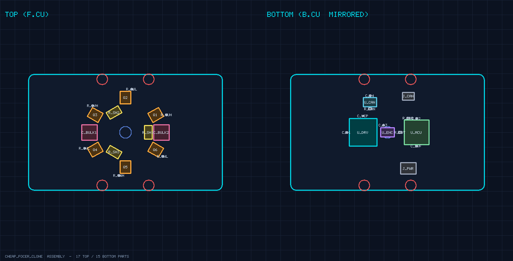
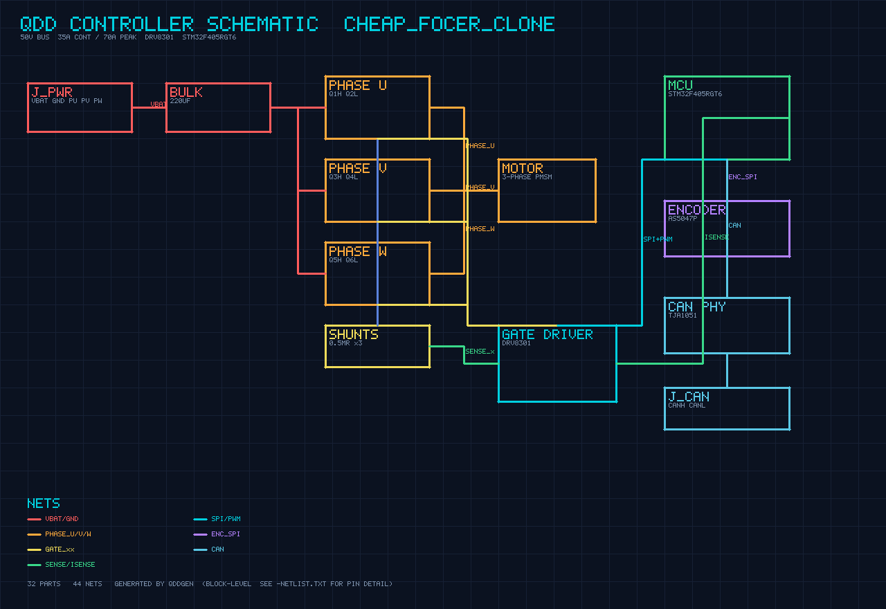

# 02. ePWM — 전압을 만드는 법

원본: `002_28377D_MCU__ePWM_성재형.pdf`

**한 줄 요약:** 전기를 아주 빠르게 **깜빡깜빡** 켰다 껐다 해서, 평균 전압을 원하는 만큼 만든다.

---

## A. PWM이 뭐야? — 깜빡임으로 밝기 조절

형광등 밝기 조절기(디머)를 떠올려 보세요. 사실은 불을 아주 빠르게 껐다 켰다 하는데,
**오래 켜 두면 밝고, 잠깐만 켜면 어둡게** 보이죠. PWM이 딱 이겁니다.

**듀티(Duty)** = 한 번의 깜빡임에서 **켜져 있는 시간의 비율**. 이게 평균 전압을 정합니다.

전원이 100V일 때, 켜진 시간 비율(듀티)만 바꾸면:

**듀티 50% → 평균 50V**
<table width="80%" cellspacing="0" cellpadding="6"><tr>
<td width="50%" align="center" style="background:#2f5f8f;color:white;border:none;">켬 (100V)</td>
<td width="50%" align="center" style="background:#e7ebf0;color:#6b7888;border:none;">끔 (0V)</td>
</tr></table>

**듀티 80% → 평균 80V**
<table width="80%" cellspacing="0" cellpadding="6"><tr>
<td width="80%" align="center" style="background:#2f5f8f;color:white;border:none;">켬 (100V)</td>
<td width="20%" align="center" style="background:#e7ebf0;color:#6b7888;border:none;">끔</td>
</tr></table>

> ✅ **듀티 올리면 → 평균 전압 올라감.** 이것만 알면 PWM의 절반은 끝.

### 왜 굳이 깜빡일까? (저항으로 줄이면 안 되나)
저항으로 전압을 낮추면 그 저항이 **열로 에너지를 버립니다**(낭비, 뜨거움).
반면 PWM 스위치는 "켤 땐 활짝, 끌 땐 완전히" 라서 **거의 안 버리고** 효율적이에요.
그래서 모터·전원에는 무조건 PWM을 씁니다.

### 모터에 특히 잘 맞는 이유
모터 코일은 **전류가 갑자기 못 변하는** 성질(인덕터)이 있어요. 전압이 깜빡여도
전류는 **평균값을 따라 부드럽게** 흐릅니다. 그래서 "50V를 계속 준 것"과 "100V를 절반만
깜빡인 것"이 모터 입장에선 거의 같습니다.

---

## B. 깜빡임은 어떻게 만들까 — "삼각파 vs 기준선"

오르락내리락하는 **삼각파(카운터)** 를 하나 만들고, **기준선(CMP)** 을 하나 그어둡니다.

- 삼각파가 기준선보다 **아래** → 핀 **켬**
- 삼각파가 기준선보다 **위** → 핀 **끔**

기준선(CMP)을 **올리면** 켜진 시간이 길어집니다 = **듀티 ↑**.

> 🔎 **외울 한 줄:** "**CMP 높이 = 듀티**."

---

## C. ePWM의 핵심 4모듈 (이것만)

ePWM은 작은 기능 여러 개의 묶음입니다. 8개나 있지만 **딱 4개만** 알면 됩니다.

| 모듈 | 역할 | 한마디로 |
|---|---|---|
| **TB** (Time-Base) | 삼각파(박자) 만들기 | 주파수 담당 |
| **CC** (Counter-Compare) | 기준선 CMP로 듀티 정하기 | 듀티 담당 |
| **AQ** (Action-Qualifier) | 언제 켜고 끌지 규칙 | 켜기/끄기 |
| **DB** (Dead-Band) | 안전 간격(데드타임) 넣기 | 안전 담당 |

### ① TB — 박자(주파수)
삼각파가 얼마나 빨리 오르내리는지가 PWM 주파수입니다. 보통 **10~15kHz** 로 씁니다.
(설정값 이름: `TBPRD`. 삼각파의 꼭대기 값이며, 이걸로 주파수를 정합니다.)

### ② CC — 듀티 (+ 한 가지 함정)
`CMPA` 라는 값에 기준선 높이를 넣으면 듀티가 정해집니다.

> ⚠️ **함정:** PWM이 돌아가는 **도중에** 기준선을 바꾸면 파형이 이상하게 찌그러집니다.
> 그래서 **Shadow 모드**(새 값을 잠깐 저장해 뒀다가 안전한 순간에 한꺼번에 적용)를 켜둡니다.
> → 그냥 "도중에 막 안 바뀌게 해주는 안전장치" 정도로 기억.

### ③ AQ — 켜고 끄는 규칙
"삼각파가 기준선을 만나면 켜라/꺼라" 같은 규칙을 정합니다. (`AQ_SET`=켜기, `AQ_CLEAR`=끄기)

### ④ DB — 데드타임 (★안전 직결, 제일 중요)
모터 한 쪽(다리)에는 **위 스위치 + 아래 스위치**가 짝으로 있고, **하나가 켜지면 하나는 꺼져야** 합니다.

> ⚠️ 만약 **위·아래가 동시에 켜지는 찰나**가 생기면 → 전원이 그대로 단락(쇼트) → **펑! 폭발.**
> 그래서 둘 사이에 **둘 다 꺼진 아주 짧은 시간(데드타임)** 을 넣어 막습니다. (보통 2µs 정도)

---

## D. 그리고 — PWM이 "제어해!" 알람을 울린다

ePWM에는 **ET(Event-Trigger)** 라는 부분이 있어서, 삼각파가 한 바퀴 돌 때마다
**인터럽트(01번 문서의 알람)** 를 울립니다. 그 알람이 울리면 그 안에서
"전류 읽고 → 계산하고 → PWM 다시 맞추기"를 합니다.

> ✅ **즉, ePWM은 전압을 만들 뿐 아니라, 제어의 박자(알람)까지 만든다.** 이게 01번과 연결고리.

---

## 30초 자가 점검
1. 듀티를 올리면 평균 전압은? → **올라감**
2. 저항 대신 PWM을 쓰는 이유? → **에너지 안 버려서(효율↑)**
3. "CMP 높이 = ___"? → **듀티**
4. 데드타임이 없으면? → **위·아래 동시 켜짐 → 단락/폭발**
5. PWM이 제어 알람을 울리는 부분 이름? → **ET**

<div style="background:#e8f5ee;border:1px solid #2e9e6b;border-radius:6px;padding:10px 14px;margin:12px 0;">
<b style="color:#2e9e6b;">✔ 이것만 기억</b><br>
• PWM = <b>깜빡임으로 평균 전압 조절</b>, 핵심은 듀티.<br>
• 핵심 4모듈: <b>TB(주파수) · CC(듀티) · AQ(켜기끄기) · DB(데드타임=안전)</b>.<br>
• ePWM이 <b>알람(인터럽트)도 울려서</b> 제어 박자를 만든다.
</div>

➡️ 다음: **03_ADC.md** (전류·전압을 숫자로 읽기)

---
<!--LV 2-->
## Lv 2 · 삼각파의 두 가지 모양 (Up vs UpDown)

레벨1에서 "삼각파(카운터)"가 오르내린다고 했죠. 사실 카운터가 도는 방식은 **두 가지**입니다.

- **톱니파 (Up 모드):** 0 → 꼭대기(TBPRD)까지 올라간 뒤 **뚝 떨어져** 다시 0부터. 한쪽으로만 셈.
- **삼각파 (UpDown 모드):** 0 → 꼭대기 → 다시 0 으로 **올라갔다 내려옴**. 좌우 대칭.

```
Up 모드(톱니):        UpDown 모드(삼각, ★모터용):
   /|  /|  /|            /\      /\
  / | / | / |           /  \    /  \
 /  |/  |/  |          /    \  /    \
─────────────         ─────────────────
```

모터 제어는 거의 항상 **UpDown(중심정렬, center-aligned)** 을 씁니다. 펄스가 주기 한가운데에
대칭으로 놓여서 **고조파(노이즈)가 적고** 전류 리플이 깨끗하기 때문이에요.

<div style="background:#eef4fb;border-left:6px solid #2f5f8f;padding:10px 14px;margin:7px 0;border-radius:6px;"><b style="color:#2f5f8f;">상보(complementary) 동작</b><br>
한 다리의 <b>위 스위치</b>가 켜진 동안 <b>아래 스위치</b>는 항상 반대로 꺼집니다(둘이 거울처럼 짝). ePWM은 채널 A 신호 하나만 만들면, 그 반대 신호 B를 <b>자동으로</b> 만들어 줍니다. 그래서 핀 6개(3다리×2)를 손쉽게 제어해요.</div>

> 🔎 **쉽게:** Up은 "한 방향 시계", UpDown은 "왔다 갔다 추시계". 모터엔 대칭이 예쁜 추시계.

<div style="background:#e8f5ee;border:1px solid #2e9e6b;border-radius:6px;padding:10px 14px;margin:10px 0;"><b style="color:#2e9e6b;">✔ 이것만 기억</b><br>
모터 PWM = <b>UpDown(중심정렬)</b> + <b>상보 동작(위·아래 반대)</b>. 깨끗하고 안전.</div>

---
<!--LV 3-->
## Lv 3 · 주파수와 듀티, 숫자로 (공식)

삼각파의 "빠르기"와 "꼭대기 높이"가 곧 주파수입니다. 먼저 카운터가 도는 클럭부터.

**① 카운터 클럭 (TBCLK):**

<div style="background:#eef2f7;border-left:4px solid #5b86b3;padding:10px 14px;margin:7px 0;border-radius:5px;font-family:Consolas;">
TBCLK = SYSCLK ÷ (HSPCLKDIV × CLKDIV)</div>

분주(나누기) 안 하면 TBCLK = SYSCLK 그대로. 이 프로젝트는 **200MHz** 입니다.

**② PWM 주파수:**

| 모드 | 공식 | 한마디 |
|---|---|---|
| **UpDown** (모터용) | `Fpwm = TBCLK / (2 × TBPRD)` | 올라갔다 내려오니 ×2 |
| **Up** (톱니) | `Fpwm ≈ TBCLK / (TBPRD + 1)` | 한 방향이라 ÷(주기+1) |

UpDown에 **2**가 붙는 이유: 한 주기에 카운터가 위로 한 번, 아래로 한 번 = TBPRD를 두 번 지나가니까요.

**③ 듀티:** 기준선 `CMPA` 가 TBPRD에 대해 차지하는 비율이 듀티 D. 즉 **CMPA ∝ TBPRD**.

<div style="background:#fbf4e8;border-left:6px solid #e0922f;padding:10px 14px;margin:7px 0;border-radius:6px;"><b style="color:#c0763a;">주의</b><br>
TBPRD를 키우면 → 주파수는 <b>낮아지고</b>, 대신 듀티를 더 잘게(고해상도) 나눌 수 있어요. 주파수와 해상도는 맞바꿈(trade-off) 관계.</div>

> 🔎 **쉽게:** TBPRD = 삼각파 꼭대기 눈금 수. 눈금이 많을수록 천천히 오르내리고(주파수↓) 듀티는 더 곱게 조절됨.

<div style="background:#e8f5ee;border:1px solid #2e9e6b;border-radius:6px;padding:10px 14px;margin:10px 0;"><b style="color:#2e9e6b;">✔ 이것만 기억</b><br>
UpDown: <b>Fpwm = TBCLK / (2·TBPRD)</b>. 듀티는 <b>CMPA</b>로 정한다.</div>

---
<!--LV 4-->
## Lv 4 · 핵심 레지스터 한 장 정리

레벨1의 4모듈(TB·CC·AQ·DB) + ET를 실제 **레지스터 이름**으로 봅니다. 이게 코드의 뼈대예요.

| 레지스터 | 모듈 | 하는 일 |
|---|---|---|
| **TBPRD** | TB | 삼각파 꼭대기 = **주기(주파수)** |
| **TBCTL** | TB | **모드**(Up/UpDown) · **분주**(HSPCLKDIV/CLKDIV) 설정 |
| **CMPA / CMPB** | CC | 기준선 = **듀티**. A=주신호, B=보조 |
| **AQCTLA** | AQ | 켜고 끌 규칙. **CAU**=올라가다 CMPA 만남, **CAD**=내려오다 CMPA 만남. 동작은 `AQ_SET`(켬)/`AQ_CLEAR`(끔) |
| **DBCTL / DBRED / DBFED** | DB | 데드밴드 켜기 + **상승(RED)·하강(FED) 지연** 카운트 |
| **ETSEL / ETPS** | ET | 인터럽트·ADC 시작(**SOC**) 언제 울릴지 (예: 카운터=0일 때) |

CAU/CAD 개념이 핵심입니다. UpDown 삼각파는 CMPA를 **두 번** 지나가요(올라갈 때 1번, 내려올 때 1번). 그 두 지점에서 각각 켜고/꺼서 **대칭 펄스**를 만듭니다.

이 신호들이 실제로 켜고 끄는 대상이 바로 보드 위의 스위치입니다.



위 보드의 **Q1~Q6** 가 3상 인버터 MOSFET 6개입니다. 다리 3개 × (위·아래) 2개 = 6개.
ePWM이 만든 신호가 이 6개 게이트로 들어가 모터에 전압을 만듭니다.

<div style="background:#e8f5ee;border:1px solid #2e9e6b;border-radius:6px;padding:10px 14px;margin:10px 0;"><b style="color:#2e9e6b;">✔ 이것만 기억</b><br>
<b>TBPRD</b>=주파수, <b>CMPA</b>=듀티, <b>AQCTLA(CAU/CAD)</b>=켜끄규칙, <b>DB*</b>=데드타임, <b>ETSEL</b>=알람. 이 신호가 <b>Q1~Q6</b>를 흔든다.</div>

---
<!--LV 5-->
## Lv 5 · 코드로 보기 — vInitEPwm 골격

레벨4 레지스터를 **설정하는 순서**가 곧 초기화 함수입니다. 개념 골격:

```c
void vInitEPwm(void) {
    // ① 박자(TB): 주기와 모드
    EPwm1Regs.TBPRD = 5000;                       // Lv6에서 계산
    EPwm1Regs.TBCTL.bit.CTRMODE = TB_COUNT_UPDOWN;// 삼각파(중심정렬)
    EPwm1Regs.TBCTL.bit.HSPCLKDIV = TB_DIV1;      // 분주 없음 → TBCLK=200MHz
    EPwm1Regs.TBCTL.bit.CLKDIV    = TB_DIV1;

    // ② 듀티(CC): 기준선 + Shadow(안전 갱신)
    EPwm1Regs.CMPA.bit.CMPA = 2500;               // 일단 50% (=TBPRD/2)
    EPwm1Regs.CMPCTL.bit.SHDWAMODE = CC_SHADOW;       // 그림자에 먼저 저장
    EPwm1Regs.CMPCTL.bit.LOADAMODE = CC_CTR_ZERO;     // 카운터=0일 때 한꺼번에 반영

    // ③ 켜끄 규칙(AQ)
    EPwm1Regs.AQCTLA.bit.CAU = AQ_CLEAR;          // 올라가다 CMPA 만나면 끔
    EPwm1Regs.AQCTLA.bit.CAD = AQ_SET;            // 내려오다 CMPA 만나면 켬

    // ④ 데드타임(DB) — 위·아래 동시켜짐 방지
    EPwm1Regs.DBCTL.bit.OUT_MODE = DB_FULL_ENABLE;
    EPwm1Regs.DBRED = 400;                         // 상승 지연 (Lv6에서 계산)
    EPwm1Regs.DBFED = 400;                         // 하강 지연

    // ⑤ 알람(ET) — 제어 인터럽트
    EPwm1Regs.ETSEL.bit.INTSEL = ET_CTR_ZERO;     // 카운터=0마다
    EPwm1Regs.ETSEL.bit.INTEN  = 1;               // 인터럽트 켜기
    EPwm1Regs.ETPS.bit.INTPRD  = ET_1ST;          // 매 주기마다
}
```

<div style="background:#fbf4e8;border-left:6px solid #e0922f;padding:10px 14px;margin:7px 0;border-radius:6px;"><b style="color:#c0763a;">Shadow가 왜 중요?</b><br>
제어 루프는 매 주기 CMPA를 바꿉니다. 만약 카운터가 펄스 도중일 때 값이 바뀌면 그 주기 파형이 깨져요. Shadow는 새 값을 그림자에 받아두고 <b>카운터=0(가장 안전한 순간)</b>에 한 번에 적용해 깔끔합니다.</div>

> 🔎 **쉽게:** 무대 뒤(그림자)에서 배우를 바꿔두고, 막이 내린 순간(카운터=0)에 교체. 관객은 끊김을 못 봄.

실제 코드는 프로젝트 `CCS_코드골격/EPwm_setup.c` 에 있습니다 (구조 동일, 핀·채널만 추가).

<div style="background:#e8f5ee;border:1px solid #2e9e6b;border-radius:6px;padding:10px 14px;margin:10px 0;"><b style="color:#2e9e6b;">✔ 이것만 기억</b><br>
초기화 순서 = <b>TB→CC(+Shadow)→AQ→DB→ET</b>. 듀티 갱신은 반드시 <b>Shadow</b>로.</div>

---
<!--LV 6-->
## Lv 6 · 실제 숫자로 계산해 보기

이 프로젝트 조건: **TBCLK 200MHz, 스위칭 20kHz, UpDown 모드**.

**① 주기 TBPRD** — Lv3 공식 `Fpwm = TBCLK/(2×TBPRD)` 를 뒤집으면:

<div style="background:#eef2f7;border-left:4px solid #5b86b3;padding:10px 14px;margin:7px 0;border-radius:5px;font-family:Consolas;">
TBPRD = TBCLK / (2 × Fpwm) = 200,000,000 / (2 × 20,000) = <b>5000</b></div>

→ 그래서 Lv5 코드의 `TBPRD = 5000`.

**② 데드타임 2µs → 카운트로:** 1카운트 = 1/200MHz = 5ns.

<div style="background:#eef2f7;border-left:4px solid #5b86b3;padding:10px 14px;margin:7px 0;border-radius:5px;font-family:Consolas;">
DBRED = 2×10⁻⁶ × 200×10⁶ = <b>400</b> 카운트</div>

→ 그래서 `DBRED = DBFED = 400`.

**③ 듀티 0.3 → CMPA:**

<div style="background:#eef2f7;border-left:4px solid #5b86b3;padding:10px 14px;margin:7px 0;border-radius:5px;font-family:Consolas;">
CMPA = 0.3 × 5000 = <b>1500</b></div>

<div style="background:#fbf4e8;border-left:6px solid #e0922f;padding:10px 14px;margin:7px 0;border-radius:6px;"><b style="color:#c0763a;">방향 주의 — AQ 극성에 따라 CMPA가 뒤집힌다</b><br>
Lv5 골격(<b>CAU=CLEAR / CAD=SET</b>)에서는 듀티 = CMPA/TBPRD 이므로 <b>듀티 0.3 → CMPA = 1500</b>이 맞습니다(이게 정답). 만약 AQ를 <b>반대로</b>(CAU=SET / CAD=CLEAR) 잡으면 CMPA 위쪽이 켜져서 같은 듀티에 CMPA = (1−0.3)×5000 = <b>3500</b>이 됩니다. 즉 1500이냐 3500이냐는 <b>"CAU=CLEAR이라서"가 아니라 AQ 극성 선택의 문제</b> — 코드의 AQ 설정과 꼭 맞춰 확인하세요.</div>

| 원하는 값 | 계산 | 결과 |
|---|---|---|
| 20kHz 주기 | 200e6 / (2·20000) | TBPRD = 5000 |
| 데드타임 2µs | 2e-6 × 200e6 | 400 카운트 |
| 듀티 30% (CAU=CLEAR 기준) | 0.3 × 5000 | CMPA = 1500 (AQ 반대면 3500) |

<div style="background:#e8f5ee;border:1px solid #2e9e6b;border-radius:6px;padding:10px 14px;margin:10px 0;"><b style="color:#2e9e6b;">✔ 이것만 기억</b><br>
200MHz·20kHz·UpDown → <b>TBPRD=5000</b>, 데드타임 2µs → <b>400</b>, 듀티는 CMPA=D×TBPRD (<b>AQ 방향 확인</b>).</div>

---
<!--LV 7-->
## Lv 7 · 데드타임의 그림자 — 전압 왜곡과 보상

데드타임은 폭발을 막는 안전장치지만, **공짜가 아닙니다**. 위·아래가 둘 다 꺼진 그 짧은 틈 동안
출력 전압이 우리가 지령한 값과 **살짝 달라집니다**. 이게 모이면 무시 못 할 **전압 왜곡**이 돼요.

```
지령 펄스:   ┌──────────┐
실제 펄스:     ┌────────┐      ← 데드타임만큼 좁아짐(전류>0일 때)
             ↑딜레이   ↑딜레이   → 평균 전압이 지령보다 작아짐
```

**왜곡의 크기** (대략):

<div style="background:#eef2f7;border-left:4px solid #5b86b3;padding:10px 14px;margin:7px 0;border-radius:5px;font-family:Consolas;">
ΔV ≈ Vdc × t_dead × F_sw</div>

스위칭 주파수가 높을수록(틈이 자주 생김), 데드타임이 길수록 왜곡이 커집니다.
게다가 **전류 방향(부호)에 따라 왜곡의 부호가 반대**예요.

<div style="background:#eef4fb;border-left:6px solid #2f5f8f;padding:10px 14px;margin:7px 0;border-radius:6px;"><b style="color:#2f5f8f;">데드타임 보상</b><br>
해법은 간단합니다. <b>전류의 부호를 보고</b>, 잃어버릴 만큼을 전압 지령에 <b>미리 더해주는</b> 것. 전류 > 0이면 +ΔV, 전류 < 0이면 −ΔV. 그러면 실제 출력이 지령에 맞아요. 저속·저전류에서 특히 효과 큼.</div>

<div style="background:#fbf4e8;border-left:6px solid #e0922f;padding:10px 14px;margin:7px 0;border-radius:6px;"><b style="color:#c0763a;">최소 펄스폭(min pulse) 문제</b><br>
듀티가 0이나 100%에 너무 가까우면 펄스가 데드타임보다도 짧아져 <b>스위치가 제대로 안 켜집니다</b>. 그래서 아주 좁은 펄스는 0으로 죽이거나(드롭) 일정 폭으로 강제하는 처리가 필요해요.</div>

> 🔎 **쉽게:** 데드타임은 "거스름돈 떼이는 수수료". 전류 방향 보고 그만큼 미리 얹어주면 본전.

<div style="background:#e8f5ee;border:1px solid #2e9e6b;border-radius:6px;padding:10px 14px;margin:10px 0;"><b style="color:#2e9e6b;">✔ 이것만 기억</b><br>
데드타임 → <b>전압 왜곡(∝ Vdc·tdead·Fsw)</b>, 부호는 전류 방향 따라. <b>전류 부호 보고 지령에 보정</b>. 너무 좁은 펄스는 따로 처리.</div>

---
<!--LV 8-->
## Lv 8 · SVPWM — 같은 전원으로 전압을 15% 더

단순한 정현파 PWM(SPWM)으로는 상전압을 최대 **Vdc/2** 까지밖에 못 만듭니다. 전원의 절반.
그런데 **공간벡터변조(SVPWM)** 를 쓰면 한계가 **Vdc/√3** 까지 올라가요.

<div style="background:#eef2f7;border-left:4px solid #5b86b3;padding:10px 14px;margin:7px 0;border-radius:5px;font-family:Consolas;">
(Vdc/√3) ÷ (Vdc/2) = 2/√3 ≈ 1.155 → <b>약 15.5% 더 큰 전압</b></div>

비결은 **3차 고조파 주입** 효과입니다. 세 상에 공통으로 살짝 변형을 더하면(상 사이엔 안 보임)
전압 여유가 생겨 한계가 올라가요. 같은 배터리로 더 빠른 속도·더 큰 토크를 뽑을 수 있다는 뜻.

**원리 — 6개 유효벡터 + 2개 영벡터:**

```
       V3(010)   V2(110)
          \  Ⅱ  /
       Ⅲ   \   /   Ⅰ
   V4 ────── ● ────── V1
     (011)  /   \   (100)
       Ⅳ   /  Ⅴ  \   Ⅵ
          /        \
       V5(001)   V6(101)
   ● 중앙 = 영벡터 V0(000)·V7(111)
   ─ ─ ─ 점선 원(반지름 Vdc/√3) = 만들 수 있는 최대
```

3상 인버터 스위치 조합은 8가지(2³). 그중 **6개는 방향이 있는 유효벡터**, **2개는 크기 0인 영벡터**입니다.
원하는 전압 벡터를 이웃한 두 유효벡터 + 영벡터의 **시간 배합**으로 만듭니다.

<div style="background:#eef4fb;border-left:6px solid #2f5f8f;padding:10px 14px;margin:7px 0;border-radius:6px;"><b style="color:#2f5f8f;">시뮬레이터 연결</b><br>
학습 프로그램의 전압벡터 화면에 그려진 <b>점선 원</b>이 바로 이 <b>Vdc/√3 한계</b>입니다. 전압 지령이 이 원을 넘으면 더는 못 만들고 찌그러져요(과변조).</div>

> 🔎 **쉽게:** SPWM은 정사각형 안에 든 원(작음), SVPWM은 육각형에 내접한 더 큰 원. 같은 상자에서 더 큰 원을 쓰는 영리한 방법.

<div style="background:#e8f5ee;border:1px solid #2e9e6b;border-radius:6px;padding:10px 14px;margin:10px 0;"><b style="color:#2e9e6b;">✔ 이것만 기억</b><br>
SVPWM = <b>6유효벡터+2영벡터</b> 시간배합. 전압 한계가 Vdc/2 → <b>Vdc/√3 (약 +15.5%)</b>. 점선 원이 그 한계.</div>

---
<!--LV 9-->
## Lv 9 · 설계 트레이드오프 — 주파수를 얼마로?

"스위칭 주파수를 높이면 좋은 것 아냐?" — 반은 맞고 반은 틀립니다. **양날의 검**이에요.

| 주파수를 ↑ 올리면 | 좋아짐 😊 | 나빠짐 😣 |
|---|---|---|
| 전류 리플 | 작아짐(부드러움) | |
| 가청 소음 | 줄어듦(20kHz↑면 안 들림) | |
| 제어 대역폭 | 빨라짐 | |
| 스위칭 손실 | | 커짐(켤·끌 때마다 손실) |
| 소자 발열 | | 뜨거워짐 |

```
손실
  │            스위칭손실 ↗
  │          ╱
  │  도통손실┄┄┄┄  ← 적정 구간(보통 10~20kHz)
  │ ╲      ╱   ↑여기
  │  ╲___╱
  └─────────────── 주파수
```

그래서 모터 구동은 보통 **10~20kHz** 에서 타협합니다. 이 프로젝트의 **20kHz** 도 "소음 안 들리면서 손실 감당되는" 지점이에요.

<div style="background:#eef4fb;border-left:6px solid #2f5f8f;padding:10px 14px;margin:7px 0;border-radius:6px;"><b style="color:#2f5f8f;">멀티 ePWM 동기화</b><br>
3상은 ePWM 모듈 여러 개로 만드는데, 셋의 삼각파 위상이 어긋나면 전류가 틀어집니다. 한 모듈을 마스터로 두고 <b>SyncOut</b> 신호를 내보내, 다른 모듈이 <b>PHSEN</b>(위상 로드 허용)으로 받아 위상을 똑같이 맞춥니다.</div>

> 🔎 **쉽게:** 합창단(3상)이 같은 지휘자(SyncOut) 박자에 맞춰야 화음이 맞음. 제각각이면 불협화음(전류 왜곡).

<div style="background:#e8f5ee;border:1px solid #2e9e6b;border-radius:6px;padding:10px 14px;margin:10px 0;"><b style="color:#2e9e6b;">✔ 이것만 기억</b><br>
주파수↑ = 리플·소음↓ 이지만 <b>손실·발열↑</b>. 적정 <b>10~20kHz</b>. 3상은 <b>SyncOut/PHSEN</b>으로 위상 동기.</div>

---
<!--LV 10-->
## Lv 10 · 더 멀리 — 인터리빙·멀티레벨·차세대 소자

기본 3상 2레벨 인버터를 넘어선 고급 기법들. 핵심은 **"리플·EMI·손실을 더 줄이자"** 입니다.

<div style="background:#eef4fb;border-left:6px solid #2f5f8f;padding:10px 14px;margin:7px 0;border-radius:6px;"><b style="color:#2f5f8f;">① 인터리빙 (Interleaving)</b><br>
여러 인버터/페이즈를 <b>위상을 어긋나게(예 180°)</b> 병렬 운전. 각자의 리플이 서로 상쇄돼 합쳐진 출력 리플과 입력 전류 리플이 크게 줄어듭니다. 같은 필터로 더 깨끗한 전류.</div>

<div style="background:#eef4fb;border-left:6px solid #2f5f8f;padding:10px 14px;margin:7px 0;border-radius:6px;"><b style="color:#2f5f8f;">② 멀티레벨 인버터</b><br>
출력 전압을 2단(±Vdc/2)이 아니라 <b>3단·5단…</b> 계단으로 만듦. 계단이 잘아 정현파에 가까워 → 고조파·EMI↓, 각 소자 전압 부담↓. 고전압·대용량에 유리.</div>

```
2레벨:  ┌─┐   ┌─┐      멀티레벨(3+):   ┌┐
       │ │   │ │                  ┌┘└┐
    ───┘ └───┘ └──            ──┘    └──  ← 계단이 정현파에 근접
   (거칠다=고조파↑)              (매끄럽다=EMI↓)
```

| 기법 | 노리는 것 | 한 줄 |
|---|---|---|
| 인터리빙 | 리플·입력전류 | 위상 엇갈려 상쇄 |
| 멀티레벨 | 고조파·EMI·소자전압 | 계단 전압으로 매끈하게 |
| 가변 스위칭주파수 | 효율·소음 | 동작점마다 최적 Fsw |
| GaN/SiC | 고속·고효율 | 더 빠르고 손실 적은 차세대 소자 |

**차세대 소자(GaN/SiC):** 실리콘보다 훨씬 빠르게 스위칭해 손실↓·고주파화 가능. 단, 너무 빠른 전압변화(dv/dt)는 **EMI·노이즈**를 키워서 — **게이트 저항**으로 속도(슬루레이트)를 적절히 늦추는 등의 대책이 함께 갑니다. (구체 수치는 소자·설계마다 다름, 검증필요)

회로 차원의 깊은 이해가 필요하면 보드 회로도를 참고하세요.



> 🔎 **쉽게:** 인터리빙=여럿이 박자 어긋나게 노 저어 배가 안 흔들림. 멀티레벨=계단을 잘게 나눠 미끄럼틀처럼 매끈하게.

<div style="background:#e8f5ee;border:1px solid #2e9e6b;border-radius:6px;padding:10px 14px;margin:10px 0;"><b style="color:#2e9e6b;">✔ 이것만 기억</b><br>
고급 = <b>인터리빙(리플 상쇄)·멀티레벨(매끈한 전압)·가변 Fsw·GaN/SiC</b>. 빨라질수록 <b>EMI 대책(게이트저항/슬루레이트)</b>이 짝.</div>

---

🎓 **레벨 1~10 완주!** ePWM으로 전압을 만들고(듀티·SVPWM), 안전하게(데드타임), 효율적으로(주파수 설계),
그리고 더 멀리(인터리빙·차세대 소자)까지 봤습니다. ➡️ 다음: **03_ADC.md**
